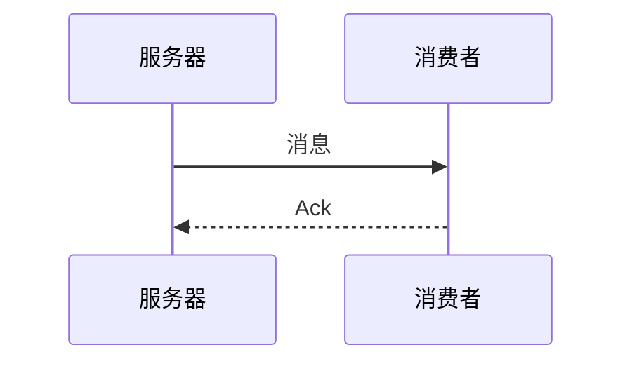

## 1. 服务端
如果RabbitMQ集群中只有一个Broker节点，那么该节点的失效将导致整体服务的临时性不可用，并且，也可能会导致消息的丢失。可以将所有消息都设置为持久化，并且对应队列的durable属性也设置为true。但是这样仍然无法避免由于缓存导致的问题:因为消息在发送之后和被写入磁盘并执行刷盘动作之间存在一个短暂却会产生问题的时间窗。
 #### 1.1 镜像队列
如果RabbitMQ集群是由多个Broker节点组成的，尽管交换器和绑定关系能够在单点故障问题上幸免于难，但是队列和其上的存储的消息却不行，这是因为队列进程及其内容仅仅维持在单个节点之上，所以一个节点的失效表现为其对应的队列不可用。

引入镜像队列(Mirror Queue)的机制，可以将队列镜像到集群中的其他Broker节点之上，如果集群中的一一个节点失效了，队列能自动地切换到镜像中的另一个节点上以保证服务的可用性。在通常的用法中，针对每一个配置镜像的队列(以下简称镜像队列)都包含一个主节点(master)和若干个从节点(slave)。

slave会准确地按照master执行命令的顺序进行动作(如下图)，故slave与master上维护的状态应该是相同的。如果master由于某种原因失效，那么“资历最老”的slave会被提升为新的master.根据slave加入的时间排序，时间最长的slave即为“资历最老”。发送到镜像队列的所有消息会被同时发往master和所有的slave上，如果此时master挂掉了，消息还会在slave上，这样slave提升为master的时候消息也不会丢失。

## 2. 生产端
通过消息持久化和镜像队列来解决因为服务器的异常奔溃导致的消息丢失。当消息的发布者在将消息发送出去之后，消息到底有没有正确到达broker代理服务器呢？默认情况下生产者是不知道消息有没有正确到达broker的，如果在消息到达broker之前已经丢失的话，消息根本就没到达代理服务器，那么这个问题该怎么解决呢？

RabbitMQ为我们提供了两种方式：

* 通过AMQP事务机制实现，这也是AMQP协议层面提供的解决方案；
* 通过将channel设置成confirm模式来实现；

### 2.1 消息持久化
 发送时将`deliveryMode`设置为2即可实现消息的持久化。
 
 __关键代码：__
 ```java
channel.basicPublish(exchangeName, routingKey,
             new AMQP.BasicProperties.Builder()
               .contentType("text/plain")
               .deliveryMode(2)
               .priority(1)
               .userId("bob")
               .build()),
               messageBodyBytes);
```
 Spring的`RabbitTemplate`发送消息时默认将`deliveryMode`其设置为2，从而实现了消息的持久化。详见:`RabbitTemplate#convertMessageIfNecessary`方法。
### 2.2 事物机制
 
 RabbitMQ中与事务机制有关的方法有三个：

方法|描述
-|-
txSelect | 用于将当前channel设置成transaction模式
txCommit | 用于提交事务
txRollback | 用于回滚事务

在通过txSelect开启事务之后，我们便可以发布消息给broker代理服务器了，如果txCommit提交成功了，则消息一定到达了broker了，如果在txCommit执行之前broker异常崩溃或者由于其他原因抛出异常，这个时候我们便可以捕获异常通过txRollback回滚事务了。

__关键代码:__
```java
try {
    channel.txSelect();
    channel.basicPublish(exchange, routingKey, MessageProperties.PERSISTENT_TEXT_PLAIN, msg.getBytes());
    int result = 1 / 0;
    channel.txCommit();
} catch (Exception e) {
    e.printStackTrace();
    channel.txRollback();
}
```

事务确实能够解决producer与broker之间消息确认的问题，只有消息成功被broker接受，事务提交才能成功，否则我们便可以在捕获异常进行事务回滚操作同时进行消息重发，但是使用事务机制的话会降低RabbitMQ的性能。
### 2.3 Confirm机制
 通过publisher confirm机制能够确保客户端知道哪些消息已经存入磁盘。与`事务机制`互斥。
 
 生产者将信道设置成confirm模式，一旦信道进入confirm模式，所有在该信道上面发布的消息都会被指派一个唯一的ID(从1开始)，一旦消息被投递到所有匹配的队列之后，broker就会发送一个确认给生产者（包含消息的唯一ID）,这就使得生产者知道消息已经正确到达目的队列了，如果消息和队列是可持久化的，那么确认消息会将消息写入磁盘之后发出，broker回传给生产者的确认消息中deliver-tag域包含了确认消息的序列号，此外broker也可以设置basic.ack的multiple域，表示到这个序列号之前的所有消息都已经得到了处理。

confirm模式最大的好处在于他是异步的，一旦发布一条消息，生产者应用程序就可以在等信道返回确认的同时继续发送下一条消息，当消息最终得到确认之后，生产者应用便可以通过回调方法来处理该确认消息，如果RabbitMQ因为自身内部错误导致消息丢失，就会发送一条nack消息，生产者应用程序同样可以在回调方法中处理该nack消息。

在channel 被设置成 confirm 模式之后，所有被 publish 的后续消息都将被 confirm（即 ack） 或者被nack一次。但是没有对消息被 confirm 的快慢做任何保证，并且同一条消息不会既被 confirm又被nack。

客户端实现生产者confirm有三种编程方式：

- 普通confirm模式：每发送一条消息后，调用waitForConfirms()方法，等待服务器端confirm。实际上是一种串行confirm了。
```java
channel.basicPublish(ConfirmConfig.exchangeName, ConfirmConfig.routingKey, MessageProperties.PERSISTENT_TEXT_PLAIN, ConfirmConfig.msg_10B.getBytes());
if(!channel.waitForConfirms()){
    System.out.println("send message failed.");
}
```
- 批量confirm模式：每发送一批消息后，调用waitForConfirms()方法，等待服务器端confirm。

    批量confirm模式稍微复杂一点，客户端程序需要定期（每隔多少秒）或者定量（达到多少条）或者两则结合起来publish消息，然后等待服务器端confirm, 相比普通confirm模式，批量极大提升confirm效率，但是问题在于一旦出现confirm返回false或者超时的情况时，客户端需要将这一批次的消息全部重发，这会带来明显的重复消息数量，并且，当消息经常丢失时，批量confirm性能应该是不升反降的。 
__关键代码：__
```java
channel.confirmSelect();
for(int i=0;i<batchCount;i++){
    channel.basicPublish(ConfirmConfig.exchangeName, ConfirmConfig.routingKey, MessageProperties.PERSISTENT_TEXT_PLAIN, ConfirmConfig.msg_10B.getBytes());
}
if(!channel.waitForConfirms()){
    System.out.println("send message failed.");
}
```
- 异步confirm模式：提供一个回调方法，服务端confirm了一条或者多条消息后Client端会回调这个方法。

    异步confirm模式的编程实现最复杂，Channel对象提供的ConfirmListener()回调方法只包含deliveryTag（当前Chanel发出的消息序号），我们需要自己为每一个Channel维护一个unconfirm的消息序号集合，每publish一条数据，集合中元素加1，每回调一次handleAck方法，unconfirm集合删掉相应的一条（multiple=false）或多条（multiple=true）记录。从程序运行效率上看，这个unconfirm集合最好采用有序集合SortedSet存储结构。实际上，SDK中的waitForConfirms()方法也是通过SortedSet维护消息序号的。 
关键代码：
```java
SortedSet<Long> confirmSet = Collections.synchronizedSortedSet(new TreeSet<Long>());
 channel.confirmSelect();
        channel.addConfirmListener(new ConfirmListener() {
            public void handleAck(long deliveryTag, boolean multiple) throws IOException {
                if (multiple) {
                    confirmSet.headSet(deliveryTag + 1).clear();
                } else {
                    confirmSet.remove(deliveryTag);
                }
            }
            public void handleNack(long deliveryTag, boolean multiple) throws IOException {
                System.out.println("Nack, SeqNo: " + deliveryTag + ", multiple: " + multiple);
                if (multiple) {
                    confirmSet.headSet(deliveryTag + 1).clear();
                } else {
                    confirmSet.remove(deliveryTag);
                }
            }
        });

        while (true) {
            long nextSeqNo = channel.getNextPublishSeqNo();
            channel.basicPublish(ConfirmConfig.exchangeName, ConfirmConfig.routingKey, MessageProperties.PERSISTENT_TEXT_PLAIN, ConfirmConfig.msg_10B.getBytes());
            confirmSet.add(nextSeqNo);
        }
```

在使用Spring`RabbitTemplate`时，通过为其设置`ConfirmCallback`即可实现异步confirm机制。

__关键代码:__

```xml
<rabbit:connection-factory id="connectionFactory"
    addresses="${rabbit.addresses}"
    username="${rabbit.username}"
    password="${rabbit.password}"
    virtual-host="${rabbit.vhost}"
    publisher-confirms="true" 
/>
```
```java
rabbitTemplate.setConfirmCallback((correlationData, ack, cause) ->    
            System.out.println("confirm--:correlationData:"+correlationData+",ack:"+ack+",cause:"+cause)
);
```

## 3. 消费端
### 3.1 Ack机制 
 
 为了保证消息从队列可靠地到达消费者，RabbitMQ提供消息确认机制(message acknowledgment)。消费者在声明队列时，可以指定noAck参数，当autoAck=false时，RabbitMQ会等待消费者显式发回ack信号后才从内存(和磁盘，如果是持久化消息的话)中移去消息。否则，RabbitMQ会在队列中消息被消费后立即删除它。

采用消息确认机制后，只要令autoAck=false，消费者就有足够的时间处理消息(任务)，不用担心处理消息过程中消费者进程挂掉后消息丢失的问题，因为RabbitMQ会一直持有消息直到消费者显式调用basicAck为止。

 `RabbitTemplate`发送消息时，已经默认将autoAck设置为false;

```java
// 处理消息...
// 手动发送ack
channel.basicAck(message.getMessageProperties().getDeliveryTag(), false);
```


